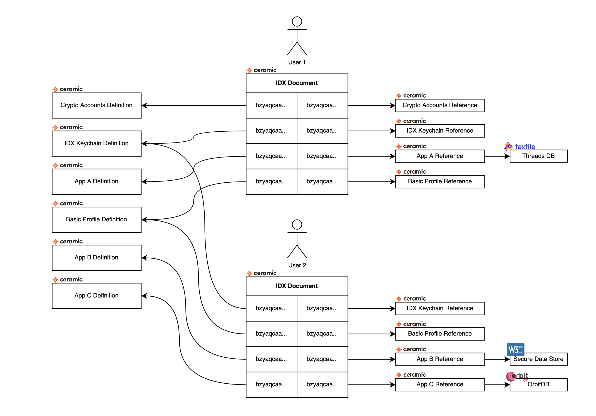

## Simple Summary

**Identity Index (IDX)** is a standard for constructing an identity-centric index of data sets. It allows developers to define **definitions** for which each user gets a unique **record**.
</br>


## Abstract

[DIDs](https://w3c.github.io/did-core/) are the W3C standard for globally-unique decentralized identifiers that commonly identify an entity across the web. A DID is the minimum requirement for establishing an interoperable, platform-agnostic digital identity. However, a digital identity is much more than a decentralized identifier.

An identity is the complete set of resources that give context and capability to a DID including all of its keys, accounts, profiles, social graphs, data, settings, services, and more. Oftentimes, these resources are scattered across the web on many different centralized platforms (application servers) and decentralized networks.

Decentralized identity depends on the ability for users to bring their identifier and resources to an application, as opposed to the current "Web2" paradigm of applications and platforms controlling identities and data. However to date, this has not been possible.

Currently there is no standardized and decentralized way of associating data sets to a DID. This limits an application's ability to permissionlessly query, discover, and resolve a DID's many resources. In turn, this limits the value of decentralized identities. We believe this is one of the reasons "Web3" has not realized its full potential.

Identity Index (IDX) is a standard for constructing an identity-centric index of data sets. IDX is decentralized, cross-platform, and DID-agnostic so it can be used by any DID, to map to any data set, on any platform.

By standardizing how data sets are associated to a DID, IDX solves discovery, routing, and resolution. This enables any app to lookup a DID and seamlessly interact with its resources regardless of where they exist or which application first created the data. As a result, IDX can unlock true identity-centric interoperability across the web.

IDX achieves this by specifying data set **definitions** and **records**. A definition is created by a developer to describe a data set for their application. When a user arrives at the application a unique record is created for the data set as defined in the definition. This means that each user will get a unique record which they control access and privacy for, while only one global definition exists for any given data set.

## Motivation

IDX aims to:

- Elevate DIDs into complete identities with the full set of resources and capabilities needed to be broadly useful
- Provide a DID-centric framework for indexing data sets that is flexible, extensible, decentralized, cross-platform, and DID-agnostic
- Simplify data set discovery and routing, wherever resources may exist (centralized servers, decentralized networks, etc)
- Provide a standard interface for developers to use when interacting with any DID
- Enable DIDs to easily integrate with other technologies, networks, platforms, and wallets
- Make it easy to build with decentralized identities


## Specification

IDX is a Ceramic document which contains mappings from **definitions** to **records**. A *definition* is a Ceramic document created by a developer that describes a *data set*. This document contains a title and description, as well as a schema document that the *record* has to conform to. In addition to this, the *definition* document may also include configuration options unique to the given data set. A *record* is also a Ceramic document which has to use the schema defined in the *record*. This document may contain data directly, but it could also contain pointers to data that lives elsewhere (e.g. in other Ceramic document, on other p2p databases, or hosted databases). Each user should only ever have one instance of any unique *definition*.

The *definition-record* pair can be stored publicly or encrypted. The former is desirable for data sets which require public discoverability. The latter is useful when possession of the data set should be kept secret. The encrypted *record* should be encrypted using a unique symmetric key. This enables the data set to be selectively disclosed by asymmetrically encrypting the symmetric key to a given recipient.



### IDX Document

The IDX document simply consist of a map from strings to DocIDs. For public data sets the *key* in this map is the DocID (without the prepended `ceramic://`) of the *definition* document, and the *value* is the DocID (with `ceramic://`) of the *record* document.

For encrypted data sets the *key* is simply a multibase (base36) encoded string of 24 random bytes. The *value* is the DocID (with `ceramic://`) of the *record* document with content encryption. See the [Data Set Keychain Definition](#data-set-keychain-definition) section for more more details on how this works.

#### Schema

**Deployment:** `k3y52l7qbv1fryjn62sggjh1lpn11c56qfofzmty190d62hwk1cal1c7qc5he54ow`

```json
{
  "$schema": "http://json-schema.org/draft-07/schema#",
  "title": "IdentityIndex",
  "type": "object",
  "additionalProperties": {
    "$ref": "#/definitions/CeramicDocId"
  },
  "definitions": {
    "CeramicDocId": {
      "type": "string",
      "pattern": "^ceramic://.+(\\?version=.+)?",
      "maxLength": 150
    }
  }
}
```

### Definitions

As mentioned previously a *definition* is a document created by a developer to describe a data set. It has five properties which as described below.

* `name` - The name of the data set
* `description` - A short description that describes the data set in a few sentences
* `schema` - A DocID of a schema document that has to be set on the *record*
* `url` - An url where more information about this data set can be found (optional)
* `config` - An object with configurations needed for this data set (optional)

The `config` object can be used for whatever is prefered by the creator of the data set. For example it might be useful to store additional schemas for the data set, urls where the data can be found, DocIDs of service providers that pin the data, etc.

#### Schema

**Deployment:** `k3y52l7qbv1fry1fp4s0nwdarh0vahusarpposgevy0pemiykymd2ord6swtharcw`

```json
{
  "$schema": "http://json-schema.org/draft-07/schema#",
  "title": "IDX Definition",
  "type": "object",
  "properties": {
    "name": {
      "type": "string",
      "maxLength": 150
    },
    "schema": {
      "$ref": "#/definitions/CeramicDocId"
    },
    "description": {
      "type": "string",
      "maxLength": 420
    },
    "url": {
      "type": "string",
      "maxLength": 240
    },
    "family": {
      "type": "string",
      "maxLength": 240
    },
    "config": {
      "type": "object"
    }
  },
  "definitions": {
    "CeramicDocId": {
      "type": "string",
      "pattern": "^ceramic://.+(\\?version=.+)?",
      "maxLength": 150
    }
  },
  "required": [
    "name",
    "description",
    "schema"
  ]
}
```

### Records

A *record* is created for the user when an application requests access to a new data set. Each user gets their own unique record that contains information about their individual data, which they control, in the data set. The record may contain the  data directly, or contain pointers to data that exists elsewhere. 

When creating a record the following steps should be taken:

1. Create a new *tile* document with `family` set to the DocID of the *definition* and `controller` set to the users DID
2. Update the document by setting the `schema` to the DocID defined in the `definition`, and the desired content

This enables the record to be looked up by only knowing the DocID of the definition and the DID of the user.

---

### IDX Keychain Definition

An encrypted data set was defined above to be stored in the IDX document as a multibase encoded string of 24 random bytes as the *key* and a DocID of the *record* as *value*. The *record* document should have all of it's content encrypted with a symmetric key, as defined by [CIP-XX](#). Now, we need a way to find out which 24 byte random value maps to which *definition*. This is what the **IDX Keychain** is used for. It stores an array of JWEs that are encrypted to the public key of the DID of the user which controls the given IDX document. Once decrypted, these JWEs should contain the following information:

```json
{
  "paths": ["/idx/<definition-DocID>"],
  "contentKey": "<multibase-base64pad-symmetric-key-32-bytes>",
  "definitionKey": "<multibase-base36-encoded-24-bytes>"
}
```

In the data above the `paths` property allows selective disclosure to apps using [EIP-2844](https://eips.ethereum.org/EIPS/eip-2844). The `contentKey` is used for content encryption in the *record*, and the *definitionKey* is used to find the correct *record* DocID in the IDX document.

#### Record schema

The **IDX Keychain** specifies the following schema in it's `schema` property, which is used for the *record* document. This schema simply represents an array of JWEs.

**Deployment:** `<data-set-keychain-ref-schema-StreamID>`

```json
{
  "$schema": "http://json-schema.org/draft-07/schema#",
  "type": "object",
  "title": "IDXKeychain",
  "properties": {
    "entries": {
      "type": "array",
      "items": { "$ref": "#/definitions/EntryJWE" }
    }
  },
  "additionalProperties": false,
  "required": [ "entries" ],
  "definitions": {
    "EntryJWE": {
      "type": "object",
      "properties": {
        "protected": { "type": "string" },
        "iv": { "type": "string" },
        "ciphertext": { "type": "string" },
        "tag": { "type": "string" },
        "aad": { "type": "string" },
        "recipients": {
          "type": "array",
          "items": {
            "type": "object",
            "properties": {
              "header": { "type": "object" },
              "encrypted_key": { "type": "string" }
            },
            "required": [ "header", "encrypted_key" ]
          }
        }
      },
      "required": [ "protected", "iv", "ciphertext", "tag" ]
    }
  }
}
```

#### Definition content

The **IDX Keychain** *definition* is created using the data below.

**Deployment:** `<data-set-keychain-def-StreamID>`

```json
{
  "name": "IDX Keychain",
  "description": "A list of encrypted symmetric keys, used for data set encryption.",
  "schema": "<data-set-keychain-ref-schema-DocID>"
}
```

#### Accessing an Encrypted Data Set

If an application want's access to encrypted definition `A` with DocID `docA` they have to request permission using the `did_authenticate` method of **EIP-2844** setting `paths = ["/idx/<docA>"]`. This will allow the app to request the particular JWE in the *IDX Keychain* that corresponds to definition `A`. Request to decrypt any other JWE in the array will result in authentication denied. Once the correct JWE is decryped the app can find the correct *record* using the `definitionKey`, and decrypt it's content using the `contentKey`.


## Rationale

**Global Data Sets:** Developers create *definitions* which describes the data used by their apps. These definitions are publicly discoverable on the Ceramic network, which enables developer to browse existing data sets. New applications can compose multiple existing data sets providing new functionality for users existing data.

**User Centric Control:** Users have personal *records* for each globally defined data set that they use. This allows users to remain in full control of their data, be it public or private. An application developer has no control over data of any individual user.

**Extensibility & Flexibility:** It is impossible to predict all of the types of resources that need to be associated with any particular DID. Therefore IDX was designed to be infinitely extensible by allowing developers to create data sets for any kind of resources.

**Decentralization & Trust:** Identity and resource indexes are mission-critical data that need to be globally-available, cross-platform, censorship-resistant, and live permissionlessly in the public domain (not on any single server). Additionally this information should be owned by a DID and will need to be updated from time to time. These requirements make Ceramic the most appropriate platform for publishing identity indexes.


## Implementation

- [**js-idx**](https://idx.xyz/): A javascript library for reading and writing data sets associated with a DID
- [**js-idx-tools**](https://github.com/ceramicstudio/js-idx-tools): A javascript library for creating definitions and related utilities

## Security Considerations

The main security consideration here is the encrypted *records*. Since the content encryption of each individual document is defined by [CIP-XX](#) we won't go into detail about that here. The array of JWEs in the *IDX Keychain* does add a bit of overhead since the app can not know beforehand which JWE to decrypt and have to try all of them. This is considered acceptable for now since it allows us to not compromise on security and privacy. Additional protocols for more efficient selective disclosure of data sets can be considered in future CIPs or updates to **EIP-2844**.

## Example Definitions

Below you can find a list of a few example definitions.

* [CIP-19](https://github.com/ceramicnetwork/CIP/blob/master/CIPs/CIP-19/CIP-19.md) - Basic Profile
* [CIP-21](https://github.com/ceramicnetwork/CIP/blob/master/CIPs/CIP-21/CIP-21.md) - Crypto Accounts
* [CIP-XX](#) - Textile ThreadsDB Template
* [CIP-20](https://github.com/ceramicnetwork/CIP/blob/master/CIPs/CIP-20/CIP-20.md) - 3ID Keychain

## Copyright

Copyright and related rights waived via [CC0](https://creativecommons.org/publicdomain/zero/1.0/).
