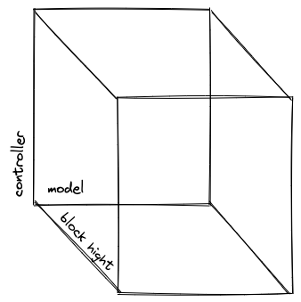
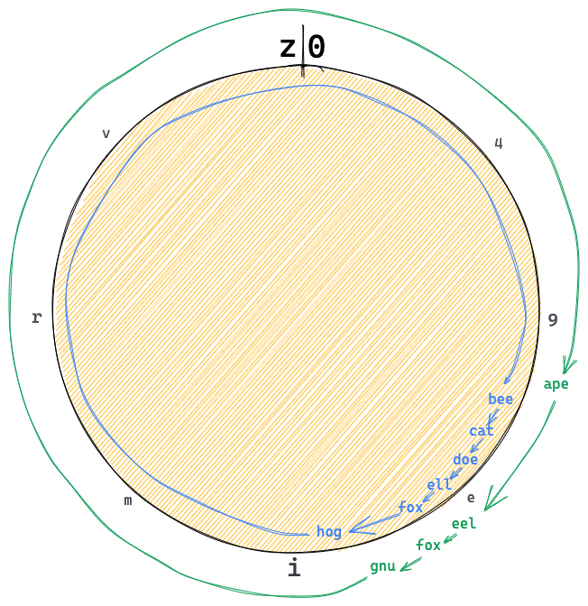
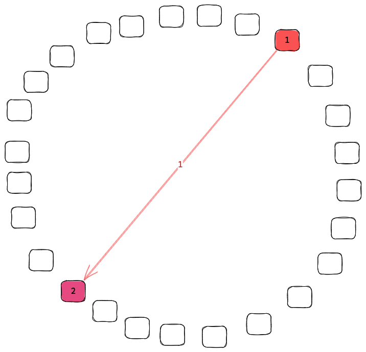
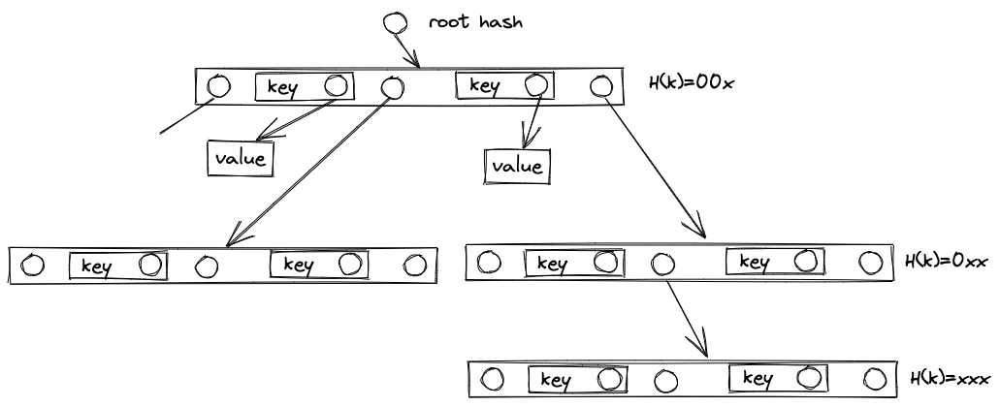
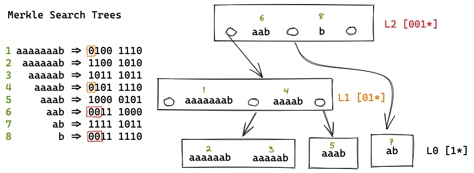
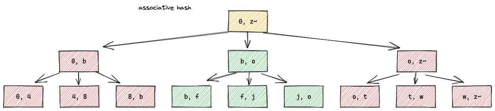
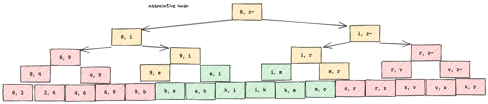

<!-- STEPS TO SUBMIT A CIP:
1. Complete the header above.
2. Fill in as much content as is appropriate for the status of your CIP.
3. Add Github labels for status, category, and type.-->

<!--[status]: Here is a description of status terms.
- `Idea`: an CIP issue that is incomplete.
- `Draft`: an CIP issue that is complete but undergoing rapid iteration and changes.
- `Last Call`: an CIP issue that is stable and ready for final review by the community.
- `Pending`: an CIP that has been submitted as a PR or merged but not finalized.-->

## Simple Summary
<!--Provide a simplified and layman-accessible explanation of the CIP.-->
Stream Sets bundle a number of streams together so the ceramic node with a common interest in those streams can synchronize efficiently, a process known as Set Reconciliation.


## Abstract
<!--A short (~200 word) description of the technical issue being addressed.-->
Stream Sets are bundles of streams that can be gossiped about as a group or in sub-ranges. In order to make ranges possible over a set of streams we need to define an order for the ranges to be over. e.g. `ceramic/<network>/<sep>/<EventID>` by assigning a sort key to each event we can define a range over the lexicographic sort of the sort keys. Now a node can advertise a have/want over a range `(first event ID, hash, last event ID)` If the node receiving the advertisements has the same set of events, then they will have the same hash and are in sync. If a node needs to advertise a new event it can send `(first event ID, hash, new event ID, hash, last event ID)` This tells any receiving node not only the new event ID but re-asserts all other events in the range. If the receiving node has any additional or missing events this is detected and can be synchronized.


New nodes interested in part of the stream set can be discovered in two ways. First if a node receives a have/want advertisement from a node it can add that node to its list of peers. Second nodes should advertise their wants to the libp2p DHT.


## Motivation
<!--Motivation is critical for CIPs that want to change the Ceramic protocol. It should clearly explain why the existing protocol specification is inadequate to address the problem that the CIP solves. CIP submissions without sufficient motivation may be rejected outright.-->
Currently ceramic nodes broadcast updates to streams to every node in the network. This requires nodes to do work processing messages that they don’t care about. At the same time if a node missed the broadcast, it would not know that the stream unless it hears a later update or performs historical sync via the CAS contract.

Stream Sets Synchronization could provide low to no overhead for nodes not synchronizing a given range, for ranges that a node is synchronizing have a high probability of getting the **latest** events from a stream shortly after any node has the events, and no need for remote connections at query time.

By pulling stream updates out of the main network channel into a stream set the nodes interested in those streams can synchronies with each other without putting load on the uninterested nodes in the network. These Stream Sets will likely be defined by a set of models that should be included in the Stream Set. They could also be defined by a set of models and controllers but the large and changing number of controllers requires more though and is not proposed here.

A stream also could potentially be included in more than one stream set if for example there are apps that want to sync every event across the entire network, they may want to form a stream set for all events that overlaps the narrower stream sets. Alternatively it might make sense to have one stream set that orders the streams by model and one that orders by controller.

The introduction of stream sets should lower the burden of running a node that is not interested in a stream set. This is due to sending the synchronization connections only to nodes that advertise an interest in a range. Stream set synchronizations could speed up the process of syncing all the historical events that are within a range by by detecting and backfilling missed updates with every synchronization.

A secondary goal of stream sets is to give a structure for sharding the stream set across ceramic nodes. By supporting an ability to synchronize only a sub-range of the stream set the burden of storing, indexing, and retrieving streams can be sharded among ceramic nodes.

Ceramic nodes also need to have a way to find the other nodes interested in the stream set so that they can synchronize with them.
Stream Sets Synchronization will rely on a DHT to discover nodes that are interested in a range as well as gossiping about
interested nodes.

By gossiping about ranges of streams ceramic nodes that are arbitrarily out of sync can synchronize all events of mutual interest. Nodes that are in sync or nearly in sync can send each other very little bandwidth. Nodes can avoid sending stream event announcements to nodes that have no interest in the stream ranges.

## Specification
<!--The technical specification should describe the syntax and semantics of any new feature.-->

### **Stream Sets Ranges (Ordering)**
We need to choose a consistent ordering to give ranges meaning.
What order should we be sorting the EventIDs
A stream set could use a model ordering like
`/ceramic/mainnet/model_controller/model/stream/event_hight/event_cid`
or a temporal ordering like
`/ceramic/mainnet/anchor_time/event_cid`.

#### **EventID sort order**
> 🚧 The EventIDs are grouped by stream but then in random order
```tsx
// Current EventID
<EventID> ::= <multibase-prefix 'k' base36><multicodec 0xce streamid><stream-type>
  <genesis-cid-bytes>
  <event-cid-bytes>
```
```tsx
// Proposed EventID
<EventID> ::=
  <multibase-prefix 'k' base36>
  <multicodec 0xce streamid>
  <stream-type varint>
  <inline-cid>

<inline-cid> ::=
  <cidv1 0x01>
  <multicodec-content-type 0x71 dag-cbor >
  <hash-function-code 0x00 identity>
  <dag-cbor-size-in-bytes varint >
  <dag-cbor-bytes [hight: number, event-cid: link]>
```
[CIDv1](https://github.com/multiformats/cid)
```
<cidv1> ::= <multibase-prefix><multicodec-cidv1><multicodec-content-type><multihash-content-address>
```
[Multihash](https://github.com/multiformats/multihash)
```
<multihash-content-address> ::= <varint hash function code><varint digest size in bytes><hash function output>
```
[multiformats/unsigned-varint](https://github.com/multiformats/unsigned-varint)

---
#### **Stream set sort order**
example lexicographical sort order
```
ceramic/<network>/<partition_key>/<EventID>
```

We could partition on `model`, `controller`, `time` , or something else using a partition key? We could even map multiple dimensions into a single partition key and then partition based on the calculated partition key.


What are the sorting orders that make sense?
- Total time ordering of all events in all streams.
    - `ceramic/<network>/<timeID>/<EventID>`
    - advantages: most divergence is in recent events
    - disadvantages: hard to shard as most load is recent events, hard to follow a stream
- Sort by StreamID lexicographic
    - `ceramic/<network>/<StreamID>/<EventID>`
    - advantages: simple to shard to StreamID ranges
    - disadvantages: following a model would be many ranges
- Sort by model/StreamID
    - `ceramic/<network>/<model>/<StreamID>/<event hight><Event CID>`
    - advantages:
    - disadvantages:

- Sort by model_group/model/stream_group/StreamID/time/event
    - `ceramic/<network>/<model controller>/<model>/<stream controller>/<StreamID>/<event hight>/<Event CID>`
    - advantages: models grouped by publisher, streams grouped by publisher, stream events in order
    - disadvantages: long keys

- Z-0rder (Hilbert Curve order)
    - `ceramic/<network>/< z(model, controller, time) >`
    - [https://youtu.be/YLVkITvF6KU](https://youtu.be/YLVkITvF6KU)
    - [https://en.wikipedia.org/wiki/Z-order](https://en.wikipedia.org/wiki/Z-order)
    - e.g.
      1. hash the model
      2. hash the controler
      3. timestamp
      3. interleave the bytes of the hash M00:C00:T00:M01:C01:T00:...
      4. cluster into chunks e.g. 64MiB files

example

partition_key = model_controller/model/stream_controller/stream/hight/event
```
did:key:z6Mkq1r4LAsQTjCN7EBTnGf7DorL28aZ4eb6akcLwJSwygBt/
kjzl6hvfrbw6c5sffjlmczg8nmbk8kwu9lmgiqfd9bxi7pxp14u674cuxp09szz/
did:key:z6Mkq1r4LAsQTjCN7EBTnGf7DorL28aZ4eb6akcLwJSwygBt/
kjzl6kcym7w8y7hyovnujm2zbxa57z0z0yhmnlsx9qe4gtyurcbg6z2aw967s0d/
0/
bafyreidx27tvivoh4hre4xrjnqprntsbmvsoujydcr5cinu4b2exqjeeue
```

```
did:key:z6Mkq1r4LAsQTjCN7EBTnGf7DorL28aZ4eb6akcLwJSwygBt/
kjzl6hvfrbw6c5sffjlmczg8nmbk8kwu9lmgiqfd9bxi7pxp14u674cuxp09szz/
did:key:z6Mkq1r4LAsQTjCN7EBTnGf7DorL28aZ4eb6akcLwJSwygBt/
kjzl6kcym7w8y7hyovnujm2zbxa57z0z0yhmnlsx9qe4gtyurcbg6z2aw967s0d/
1/
bagcqcerand3n6q246mfo2v7d6i7aacpxlfnfprhyid5rcnej2bawqnlnsogq
```

this would be about 300 chars so we may want to abbreviate
model_controller/model/stream_controller/stream/hight/event
`JSwygB/xp09sz/JSwygB/w967s0/0/bafyreidx27tvivoh4hre4xrjnqprntsbmvsoujydcr5cinu4b2exqjeeue`
`JSwygB/xp09sz/JSwygB/w967s0/1/bagcqcerand3n6q246mfo2v7d6i7aacpxlfnfprhyid5rcnej2bawqnlnsogq`

Model_controller keeps model published by the same model creator together.
Model keeps all the documents of a model together.
Stream_controller keeps streams published by the same stream creator together.
StreamID keeps the updates to a stream together.
Hight keeps the updates to a stream in order.

Since interests are expressed as interest ranges a ceramic node interested in a set of models relevant to an application
will be able to subscribe with a small number of ranges. The number of ranges will be on the order of the number of
model_controllers they are interested in.

### **Interest Advertisements**
In order to discover peers with over lapping interests nodes must advertise there interest ranges to the network.

#### **DHT peer discovery**
1. If known peer list too small
    - Find providers in the DHT for the given StreamSetID `ceramic/<network>/<partition_key>/` (e.g. model)
    - Add the node to your known peer list if query receives a response.
    - Advertise your node's stream set ranges of interests on the DHT.
2. Send query to provider(s)
    - Select peer(s) at random
    - Maintain an internal reputation list for peers
        - How up to date are they.
        - Latency.
        - Interests
    - The query should include data about:
        - The stream ranges you want.
        - The stream events you have.
        - If sub-range out of sync recur.
3. Providers responds with their interests
    - The response should include data about:
        - The stream events they have.
        - The stream ranges they want.
        - If sub-range out of sync recur.
    - The node should add you to their known peer list after responding.
    

Periodically repeat the process above to achieve eventual consistency.

```
(start, (ahash, cid?), divider, (ahash, cid?), stop)
```

```ts
type InterestRange struct {
	first event_key // A string less the any event of interest.
	dividers [
    {
      associative_hash string // the associative hash of all event_keys in sub-range
      sub_tree CID // [optional] the CID of the sub-tree for static trees

      // an EventID larger then any EventID in the preceding sub-range
      // and less then any in the subsequent sub-range
      last event_key
    }
  ]
}

type Interests: InterestRange[]
```

#### **Interactive**
One or more interest range,
each containing one or more sub-tree associative hashs.
```
(EventID (sub-tree-ahash EventID)+ )+
```
We follow a synchronization protocol inspired by
"Range-Based Set Reconciliation and Authenticated Set Representations"
[[arXiv:2212.13567](https://doi.org/10.48550/arXiv.2212.13567)]

---
To keep the example small we substitute event keys like
`JSwygB/xp09sz/JSwygB/w967s0/0/bafyreidx27tvivoh4hre4xrjnqprntsbmvsoujydcr5cinu4b2exqjeeue`
or
`JSwygB/xp09sz/JSwygB/w967s0/1/bagcqcerand3n6q246mfo2v7d6i7aacpxlfnfprhyid5rcnej2bawqnlnsogq`
with short strings like `ape` and `bee`.


You initiate a synchronization by sending a hash covering the entire range.
```js
their_events: {"bee", "cat", "doe", "eel", "fox", "hog"}
your_events:  {"ape", "eel", "fox", "gnu"}

you: -["ape", h("eel", "fox", "gnu"), "ape"]->
```
They don't have the same hash so they split the range near the middle at `"eel" `
```js
their_events: {"ape", "bee", "cat", "doe", "eel", "fox", "hog"}
your_events:  {"ape", "eel", "fox", "gnu"}

them: <-["ape", h("bee", "cat", "doe"), "eel", h("fox", "hog"), "ape"]-
```
You have nothing from `"ape"` to `"eel"` so send `0`.
Your hash from `"eel"` to `"ape"` dose not match so split range on `"gnu"`
```js
their_events: {"ape", "bee", "cat", "doe", "eel", "fox", "hog"}
your_events:  {"ape", "eel", "fox", "gnu"}

you: -["ape", 0, "eel", h("fox"), "gnu", 0, "ape"]->
```
They see that you don't have any keys form `"ape"` to `"eel"` so they send the entire set.

They have a different hash from `"gnu"` to `"ape"` and split the range on `"hog"`
```js
their_events: {"ape", "bee", "cat", "doe", "eel", "fox", "gnu", "hog"}
your_events:  {"ape", "eel", "fox", "gnu"}

them: <-["ape", 0, "bee", 0, "cat", 0, "doe", 0, "eel", h("fox"), "gnu", 0, "hog", 0 "ape"]-
```

You now have the same hash between `"ape"`, `"bee"`, `"cat"`, `"doe"`, `"eel"`, `"hog"`, and `"gnu"` there is nothing left to send.
You send the hash covering the entire range so they know you are done and can restart if the sets have diverged as the protocol was running.
```js
their_events: {"ape", "bee", "cat", "doe", "eel", "fox", "gnu", "hog"}
your_events:  {"ape", "bee", "cat", "doe", "eel", "fox", "gnu", "hog"}

you: -["ape", h("bee", "cat", "doe", "eel", "fox", "hog", "gnu"), "ape"]->

```

In this example only `"fox"` was never sent across the wire but in large sets with only tiny fractions of differences most keys will never be sent across the wire.
> ToDo: should we merge 
> ```
> ["ape", h("bee", "cat", "doe", "eel", "fox", "hog", "gnu"), "ape"]
> ```
>  to
> ```
> [h("ape", "bee", "cat", "doe", "eel", "fox", "hog", "gnu")]
> ```
> to represent the entire ring?

---
#### **Immutable object store**
A slight variant of the protocol can be used with a smart client and a dumb object store. Where all the computation takes place on the client and the storage just serves values for keys.

For syncing with an immutable object store we add CIDs to the intermediate nodes of a tree. This would be DAG-JSON or DAG-CBOR
```
(EventID (sub-tree-ahash, sub-tree-CID, EventID)+ )+
```
This protocol can be run against a object store. Instead of the remote deciding which segments to send a pre-built b-tree is stored in the object store. The client fetches the root of the b-tree. If the client has the same associative hash `sub-tree-ahash` for a subtree then it skips that subtree if it differs then it requests the b-tree node with `sub-tree-CID`. This continues recursively until all the events in the stored b-tree are synced down to the client.

The use of synchronization against an object store may improve the experience of syncing a brand new node or a node that has been down for an extended period of time. The long down node could start by synchronizing against a weekly snapshot and only after that sync with live nodes getting the bulk of the dataset from the object store.

#### **DHT for interest discovery**
In order to discover other ceramic nodes that have overlapping interest
a node could announce itself in the DHT as interested in a model.
the dht key would be derived by `separatorKey` and `separatorValue`
```
key =  are set, use `partition = hash(separatorKey | separatorValue)`
```
### **Random Peer Synchronization Order**
When synchronizing we want to sync with nearby nodes with higher probability since this is lower cost but also sometimes with the far away nodes so that the whole network is synchronized. By tracking the latency of other nodes with overlapping interests we can choose a peer proportional to the overlapping interests and inversely proportional to the latency.
|| keys in overlapping interests || / latency



The number of nodes with the event will grow exponentially until it saturates the network.


## Rationale
<!--The rationale fleshes out the specification by describing what motivated the design and why particular design decisions were made. It should describe alternate designs that were considered and related work, e.g. how the feature is supported in other languages. The rationale may also provide evidence of consensus within the community, and should discuss important objections or concerns raised during discussion.-->
### Motivation for the design

Goals:

- Low to no overhead for peers not subscribed to the stream being queried.
- High probability of getting the ******latest****** tip (e.g. resilience to eclipse attacks etc.)
- Low overhead for the querying peer (e.g. no requirement to connect to and query a massive number of peers)

Ceramic has a model where each ceramic node with an interest in a stream stores the contents of the stream. This means when a stream is created or updated each ceramic node should eventually hear about the new event and update its stream tip store.

Currently this is being done by using a LibP2P PubSub channel. This works for low amounts of traffic while a node is up and listening to the channel. There are two main drawbacks of this method. One that if a node is down and misses an update it will not find out about the stream until the next update. Since the next update may never come nodes need to periodically run Historical Data Sync to discover events that it missed but are successfully anchored. Two that every node needs to process every update. Even if a node is only interested in a few low frequency models or controllers it still needs to be a large enough node to handle all updates and filter for the one that it is interested in.

The LibP2P PubSub channel is meant for data that has only a limited time of interest. It only remembers messages for a short time then expires them. If a node gets very behind in processing the incoming message queue it can re-broadcast messages after the other nodes have forgotten it causing the message to be redelivered to all nodes in the channel. Since the node is way behind it will see its own message later and re-re-broadcast it. This infinitely looping message can slow down other nodes that start re-broadcast messages leading to a network storm. A single slow, or malicious, node can harm the entire network’s ability to use the channel. Event update lost in the storm may not be picked up until Historical Data Sync runs.

By switching to a set reconciliation gossip protocol (SRGP) we solve both problems.

One, if a node missed a stream update it will detect that the node it is synchronizing with has an event that it does not. A node could go down for years and when it rejoined the network it would just sync back to the current state.

Two, if a node is only interested in a subset of the streams, it can synchronize only the ranges that it cares about. A single node that is too slow to keep up with the number of streams it is interested in will start a synchronization that will never finish but will only cause load on the node that it is synchronizing with and not cause a network wide disruption.

### Alternate designs considered and related work

Hash graph stile gossip

Each node collects the event that acer on that node into an update block. Each time a node receives an update block from a different node it puts the CID of its previous block and the incoming block at the end to finish that update block and starts a new one. Then send the finished block to a random ceramic node. Since each block has the CID of two earlier blocks if can follow back to the beginning of time.

This was rejected since it did not allow for a node to follow a limited subset of the streams.

Predicated LibP2P PubSub channels

Can we change LibP2P PubSub to only send the events that a node cares about to limit the number of messages a node needs to process.

If we can use a TTE(time to expire) as part of the predicate we may be able to solve the network storm problem.

This was rejected because it does not solve the missed messages problem.

We still plan to revisit this in the future


## Backwards Compatibility
<!--All CIPs that introduce backwards incompatibilities must include a section describing these incompatibilities and their severity. The CIP must explain how the author proposes to deal with these incompatibilities. CIP submissions without a sufficient backwards compatibility section may be rejected outright.-->
Backwards compatibility goes here.


## Implementation
<!--The implementations must be completed before any CIP is given status "Final", but it need not be completed before the CIP is accepted.-->
Implementation goes here.


## Security Considerations
<!--All CIPs must contain a section that discusses the security implications/considerations relevant to the proposed change. Include information that might be important for security discussions, surfaces risks and can be used throughout the life cycle of the proposal. E.g. include security-relevant design decisions, concerns, important discussions, implementation-specific guidance and pitfalls, an outline of threats and risks and how they are being addressed. CIP submissions missing the "Security Considerations" section will be rejected. An CIP cannot proceed to status "Final" without a Security Considerations discussion deemed sufficient by the reviewers.-->
The associative hash functions are only secure if the node is asked to produce the EventIDs that hash to the SHAs that make up the SumOfShas associative hash.


## Appendix
### **B#tree (B hash trees)**
e.g. [MST](https://hal.inria.fr/hal-02303490/document) / [Prolly Trees](https://docs.dolthub.com/architecture/storage-engine/prolly-tree)

Advantage:
  - Can be sharded to split among nodes.
  - Can have independent tree structure, fanout, balancing, or leveling.

Disadvantage:
  - A stream set must agree on a sorting order of events.



The B#tree (Bee-Hash-Tree) is a form of B-tree
where the links are hashes rather than pointers.

1. Pointers are CIDs (hashes)
2. iNode is functionally **dependent** on the nodes that **the node points to**.
3. iNode is functionally **independent** of the nodes that **point to the node**.
4. Keys and subtrees are in sorted order within an iNode
5. Level is functionally dependent set of keys, and optionally values




The MST uses only the hash of the key to determine the level of the tree where that key is stored.
This will lead to probabilistically log(n) depth and log(n) keys in the per node.
The Prolly tree uses a running hash of the keys from left to right to determine level of the tree.
Sliding a fixed-size window through it, one byte at a time.
This enables the Prolly Tree to better calibrate the node size variance.
e.g. As the node size grows increase the probability of a boundary. 
This will reduce the odds of small nodes and large nodes
in favor of target size nodes.


### **Associative Hash Function (SumOfShas)**
If we want to calculate the hash of a range of
EventIDs without needing to visit all of the events
we can use an associative hash function where the grouping
of EventIDs is not relevant to the final hash.

```
h((A, B), C) = h(A, (B, C))
```

e.g. use `sum(sha256(EventID) for EventID in Stream Set)`
each node in the tree can store the associative hash of each
sub tree along with its max and min we only need to recurse into that sub-tree if the range end is in the sub-tree. Since a range has only two ends, start and stop, we can calculate the associative hash by visiting only twice the depth of the tree number of nodes `2*log_b(n)`
where b is the fanout and n is the number of EventIDs.

A b-tree with fanout 3:


A b-tree with fanout 2:

## Copyright
Copyright and related rights waived via [CC0](https://creativecommons.org/publicdomain/zero/1.0/).
