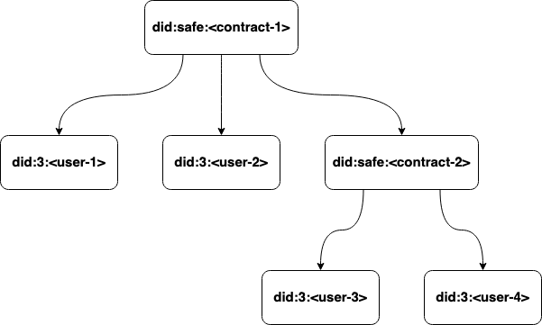

## Motivation
The [Safe](https://gnosis-safe.io/) is a smart contract wallet that allows shared ownership of different digital assets including a digital identity. An example would be the usage of a Safe contract to represent a DAO. To be able to use the Safe as a digital identity it should be possible to register a DID for a Safe.

## Specification
The Safe DID Method converts any instance of the [Gnosis Safe](https://gnosis-safe.io/) smart contract system, deployed on any blockchain, into a DID. The list of owners from the `OwnerManager.sol` module gets converted into a list of *controller* DIDs in the resolved DID document. This is achieved by using the *Chain Agnostic Improvement Proposals* to describe the smart contract address, as well as the Ceramic network to find the DID associated with the owners of the Safe contract.

### DID Method Name

The name string that shall identify this DID method is: `safe`.

A DID that uses this method MUST begin with the following prefix: `did:safe`. Per the [DID specification](https://w3c.github.io/did-core/), this string MUST be in lowercase. The remainder of the DID, after the prefix, is specified below.

## Method Specific Identifier

The method specific identifier is simply a [CAIP-10 Account ID](https://github.com/ChainAgnostic/CAIPs/blob/master/CAIPs/caip-10.md).

#### Example

In the example below we see a

```
did:safe:eip155:1:0xff6229bc3655cf0204e850b54397d3651f5198c4
```

### CRUD Operation Definitions

In this section the CRUD operations for an Safe DID are defined.

#### Create

Create a Gnosis safe contract on any EVM chain.

#### Read/Verify

Extract the Account ID from the method specific identifier. From it you can learn which Safe contract on which blockchain to look up the owners. Once you have the owner's accounts convert them to [CAIP-10 Account ID](https://github.com/ChainAgnostic/CAIPs/blob/master/CAIPs/caip-10.md) by combining it with the Chain ID from the Account ID from the safe DID. Using the Ceramic [`caip10-link`](https://github.com/ceramicnetwork/CIP/blob/main/CIPs/CIP-7/CIP-7.md) doctype we can now look up the DID(s) which these account(s) points to.

Here's and example of how to make this lookup using the javascript Ceramic api. This function will return either `null` or the DID related to the given account id.

```jsx
async function getControllerDid(accountId: string) {
  const caip10Doc = await ceramic.createDocument('caip10-link', {
    metadata: {
      controllers: [accountId]
    }
  })
  return caip10Doc?.content
}
```

Once we have retrieved the DID from the `caip10-link` of each owner respectively we simply construct the DID document as follows (here `controller-did-<n>` is the DIDs returned by the `caip10-link`).

```json
{
  "@context": "<https://w3id.org/did/v1>",
  "id": "<did>",
  "controller": ["<controller-did-1>", "<controller-did-2>", "<controller-did-3>"]
}
```

If the `caip10-link` returned `null` (i.e. the account doesn't have a DID) we simply omit that owner from the `controller` property.

#### Resolving using the `versionTime` parameter

When the [`versionTime`](https://www.w3.org/TR/did-spec-registries/#versionTime-param) query parameter is given as a DID is resolved it means that we should try to resolve the specific version of the DID document that was valid for the given point in time.

The resolution process requires the use of the *[blocks* subgraph](https://thegraph.com/explorer/subgraph/yyong1010/ethereumblocks) which is available for multiple different EVM based blockchains. From it we retreive the *blocknumber* of the most recent block at the given timestamp. We can then use the *blocknumber* to look up the owners of the Safe contract at that block using the normal Ethereum json-rpc. Once the owners at this point in time are known the `caip10-link` can be looked up for them. Here we also provide the `atTime` option when looking up the `caip10-link` to make sure we get the DID which the owners account pointed to at that point in time.

#### Update

Change the owners of the Safe contract on-chain.

#### Deactivate

Not supported.

### Security Requirements

The Safe DID derives most of its security properties from the blockchain which the given contract lives on, and the Ceramic protocol. The security of different blockchains may vary so implementers may choose to limit their implementations to specific EVM based chains. Ceramic most notably provides *censorship resistance*, *decentralization*, and requiring a minimal amount of data to be synced to completely verify the integrity of the `caip10-link`s used to find the controller DIDs. For more details see the Ceramic [specification](https://github.com/ceramicnetwork/ceramic/blob/master/SPECIFICATION.md).

### Privacy Requirements

The Safe DID utilizes a few components. First, blockchains provide a public, immutable audit trail of all previous owners of a Safe contract; these owners are blockchain accounts. Second, the `caip10-link` document on Ceramic similarly provides an audit trail for which DID a specified blockchain account has linked to over time. The combination of these two proofs allows the Safe DID to permissionlessly create pubic mappings from a Safe DID -> blockchain accounts (owners) -> DIDs (owners). This allows the Ceramic protocol to enforce decentralized access control permissions that only allows the current owners of the Safe contract to make updates to content or resources owned by the Safe DID.

### Encrypting data to all Safe owners

A desirable feature of a DID method for the Gnosis Safe contract is that one can encrypt data to all the owners of the Safe. This can be achieved by first resolving the `did:safe`, then resolving all the `controller` DIDs. Once we have these we can retrieve the public encryption key (key exchange key) from these DIDs. 

If one of the owners of *Safe contract 1* is a *Safe contract 2* it's desirable that when encrypting a message to *contract 1* that message can be read by the owners of *contract 1* as well as the owners of *contract 2* this can easily be achieved by recursively looking up the `controller`s of the given DIDs, see figure 1.



Figure 1: Safe contract 1 has Safe contract 2 as an owner. This is mirrored by the DID structure which allows for recursive lookup of keys.

## Copyright
Copyright and related rights waived via [CC0](https://creativecommons.org/publicdomain/zero/1.0/).
