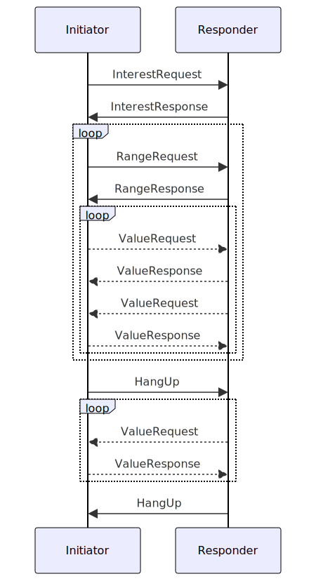

## Simple Summary

Recon is a protocol for nodes to express their interests, and for them to efficiently synchronize events in the
intersection of those interests.

## Abstract

Recon is a two-phase protocol in which we first filter by common interests and then use a divide-and-conquer strategy
to synchronize the events in the intersection of those interests.

To be able to synchronize events in the intersection of interests, we need to define a total order over the events. This
is done by lexicographically sorting the CID bytes of the events. 

The three dimensions we want to filter on are separator, controller, and time.

## Motivation

Currently, nodes broadcast updates to streams to every node in the network using a single libp2p pubsub topic. This
incurs a lot of work on all nodes to process messages that they don’t necessarily care about. It also means that the
throughput of the network is limited by the bandwidth, leading either to prioritizing high bandwidth nodes or greatly
limiting the network throughput to support low bandwidth nodes. Furthermore, if a node missed the broadcast, it would
not detect the missing stream events unless it hears a later update or uses some out of band synchronization protocol
like "historical data sync" in ComposeDB that scans the Ethereum blockchain for anchor transactions.

Recon aims to provide low to no overhead for nodes with no overlapping interests, while retaining a high probability of
getting the **latest** events from a stream shortly after any node has the events, without any need for remote
connections at query time. By ceasing to publish updates in the pubsub channel and instead organizing them into
interests, nodes interested in those streams can synchronize with each other without putting load on uninterested nodes
in the network. A secondary goal of interests is to give a structure for sharding a stream set across multiple nodes. By
supporting the ability to synchronize only a sub-range of the interest, the burden of storing, indexing, and retrieving
streams can be sharded among nodes. 

Finally, nodes also need a way to find other nodes interested in the same streams, so that they can synchronize with
them. Recon relies on nodes gossiping their interests to peers, as well as keeping a list of their peers' interests.
This way, nodes that are in sync, or nearly in sync, stay in sync with very little bandwidth. Nodes can also avoid
sending stream event announcements to nodes that have no interest in the stream ranges. 

## Specification

### Interests

```json
{
  "peer_id": "12D3KooWQuKj4A11GNZ4MmcAmJzCNGZjArjyRTgkLhSutqeqVypv",
  "sep_key": "model",
  "sep_value": "kjzl6hvfrbw6c82mkud4qs38zl4hd03ifoyg2ksvfjkhuxebfzh3ef89vwvtvrr",
  "sep_value_range": ["kjzl6hvfrba", "kjzl6hvfrbz"],
  "controller": "did:key:zGs1Det7LHNeu7DXT4nvoYrPfj3n6g7d6bj2K4AMXEvg1",
  "controller_range": ["did:key:zGs1Det7LHNea", "did:key:zGs1Det7LHNez"],
  "after": 1710536438,
  "after_range": [1710500000, 1710599999]
  "network_id": "mainnet",
  "expires": 1710600000,
}
```

The various filters of an Interest can be expressed as an exact match or as a range (using the `*_range` fields).

For an exact match, we simply set the value of the field to the exact value we want to match. For example, to match all
streams with a `sep_value` of `kjzl6hvfrbw6c82mkud4qs38zl4hd03ifoyg2ksvfjkhuxebfzh3ef89vwvtvrr` we would set `sep_value`
to `kjzl6hvfrbw6c82mkud4qs38zl4hd03ifoyg2ksvfjkhuxebfzh3ef89vwvtvrr`.

For a range, we set the value of the appropriate `*_range` field to an array of two values representing the lower and
upper bounds of the range, inclusive of the lower bound and exclusive of the upper bound, i.e. [start, stop).

The `network_id` field is used to separate different networks. For example, the mainnet and testnet networks would have
different `network_id` values.

The `expires` field is used to indicate when the interest is no longer valid. This is useful for nodes to know when to
stop synchronizing for a particular interest with a peer.

### EventIds

The metadata used to describe an Event can be represented by an Event ID. One way to construct such an Event ID is given
below:

```js
concatBytes(
    varint(0xce), // streamid varint
    varint(0x05), // cip-124 EventID varint
    varint(network_id), // network_id varint
    last8bytes(sha256({sep_key}|{sep_value})), // separator [u8; 8]
    last8bytes(sha256(controller)), // controller [u8; 8]
    last4bytes(init_event_cid_bytes), // StreamID [u8; 4]
    event_cid_bytes, // [u8]
)
```

Where:
* `0xce` is the streamid multicodec as defined in the [multicodec table](https://github.com/multiformats/multicodec/blob/master/table.csv). 
* `0x05` is the streamtype code for an cip-124 EventID as defined in the [streamTypes table](../tables/streamtypes.csv).
* `network_id` is a number as defined in the [networkIds table](../tables/networkIds.csv)
* `sep_key` comes from the `header.sep` field of an Event. 
* `sep_value` comes from the `header.{sep_key}` field of an Event.
* `controller` comes from the `header.controllers.0` field of an Event. The `controllers` field in the Event `header` is
  a list of DIDs that are allowed to write to the stream.
* `init_event_cid_bytes` is the CID of the first Event of this stream.
* `event_cid_bytes` the CID of the event itself
* `last8bytes` and `last4bytes` takes the last N bytes of the input and prepends with zeros if the input is shorter

### Recon State Machine



The Recon protocol is asymmetric with a role for the initiator and a role for the responder. Our philosophy is to put
the burden of the work on the initiator, and to make the responder's work as simple as possible.

All Recon messages are CBOR-encoded.

#### InterestRequest

The initiator sends an `InterestRequest` message to the responder. The `InterestRequest` message contains the
initiator's interests.

```json
{
  "InterestRequest": [
    {
      "start": [],
      "end": [
        255
      ]
    }
  ]
}
```

#### InterestResponse

The responder processes the initiator's `InterestRequest` message and sends an `InterestResponse` message back. When the
responder receives the `InterestResponse`, it pushes the range from the common interests onto the unsynced ranges stack.

```json
{
  "InterestResponse": [
    {
      "start": [],
      "end": [
        255
      ]
    }
  ]
}
```

#### RangeRequest

Once interests have been exchanged, the initiator pops a range off the unsynced ranges stack and sends a `RangeRequest`
message with that range to the responder.

```json
{
  "RangeRequest": {
    "first": [],
    "hash": {
      "hash": [
        185,
        77,
        39,
        185,
        147,
        77,
        62,
        8,
        165,
        46,
        82,
        215,
        218,
        125,
        171,
        250,
        196,
        132,
        239,
        227,
        122,
        83,
        128,
        238,
        144,
        136,
        247,
        172,
        226,
        239,
        205,
        233
      ],
      "count": 0
    },
    "last": [
      255
    ]
  }
}
```

#### RangeResponse

There are four possible responses to a `RangeRequest` message:
- If the range hashes match, the initiator and responder are in sync and no response is necessary.
- If the `RangeRequest` contained the zero-hash, this means that the initiator had no events in that range. The
  responder sends a `ValueResponse` messages for all the events in that range. After all the values have been sent, the
  responder sends a `RangeResponse` with the hash of the range.
- If the `RangeRequest` contains a non-zero hash but the responder has no events in that range, the responder sends a
  `RangeResponse` with the zero-hash. This indicates to the initiator that it needs to send all the events in that
  range as `ValueResponse` messages to the responder.
- If both the initiator's `RangeRequest` and the responder's `RangeResponse` contain non-zero hashes that do not match,
  the responder splits the range and sends a `RangeResponse` message with the split ranges to the initiator. The
  initiator pushes the split ranges onto the unsynced ranges stack.
- As long as the initiator has ranges on the unsynced ranges stack, it will continue to send `RangeRequest` messages to
  the responder as above.

```json
{
  "RangeResponse": [
    {
      "first": [],
      "hash": {
        "hash": [
          185,
          77,
          39,
          185,
          147,
          77,
          62,
          8,
          165,
          46,
          82,
          215,
          218,
          125,
          171,
          250,
          196,
          132,
          239,
          227,
          122,
          83,
          128,
          238,
          144,
          136,
          247,
          172,
          226,
          239,
          205,
          233
        ],
        "count": 0
      },
      "last": [
        255
      ]
    }
  ]
}
```

#### ValueRequest

A `ValueRequest` message can be sent in either direction when either a `RangeRequest` or a `RangeResponse` is received
with a fencepost event ID that the node does not have the event for.

```json
{
  "ValueRequest": [
    104,
    101,
    108,
    108,
    111,
    32,
    119,
    111,
    114,
    108,
    100
  ]
}
```

#### ValueResponse

There are two cases in which `ValueResponse` messages are sent:
- The first is on receiving a `ValueRequest` for a particular event.
- The second is on receiving a `RangeRequest` or `RangeResponse` for a range with the zero-hash, the receiving node
  responds with a `ValueResponse` for each event in that range.

```json
{
  "ValueResponse": {
    "key": [
      104,
      101,
      108,
      108,
      111,
      32,
      119,
      111,
      114,
      108,
      100
    ],
    "value": [
      1,
      2,
      3,
      4,
      5
    ]
  }
}
```

#### HangUp

Once the initiator has no more ranges on its unsynced ranges stack and no pending `ValueResponse` messages to send, it
sends a `HangUp` message to the responder.

After receiving the `HangUp` message from the initiator, the responder will continue to send any pending `ValueRequest`
or `ValueResponse` messages. Once it has sent these messages, it will also send a `HangUp` message to the initiator. 

```json
"ListenOnly"
```
```json
"Finished"
```

### Recon Message

The Recon protocol uses a binary string as a message for communication. This message is constructed in the following way,

```
(EventId (Ahash EventId)+ )
```

Every recon message starts and ends with an eventId and in between every eventId there is an ahash (see [Appendix A](#appendix-a-associative-fash-function)) of all of the eventIds in-between. For efficiency the ahash can be represented using a b-tree under the hood (see [Appendix B](#appendix-b-btree-b-hash-trees)), but this is not a strict requirement. The message can be a binary string because both eventIds and ahash use multicodes so the parser can know when the end of any particular eventId or ahash has been reached.

### Stream Set Ranges

With the definition of eventIds above we get an absolute ordering of events. We can now define subsets of the total range of all eventIds by defining a start and a stop eventId. 

For example, to construct the range of all streams defined by the *Model* `kjzl6hvfrbw6c82mkud4qs38zl4hd03ifoyg2ksvfjkhuxebfzh3ef89vwvtvrr`, we would construct the start and stop eventIds as follows:

```js
start = eventId(
    network_id = 0x00, // mainnet
    sort_value = last8Bytes(sha256(kjzl6hvfrbw6c82mkud4qs38zl4hd03ifoyg2ksvfjkhuxebfzh3ef89vwvtvrr)),
    controller = last8Bytes(repeat8(0x00)), // stream controller DID
    init_event = last4Bytes(repeat4(0x00)) // streamid
)

stop = eventId(
    network_id = 0x00, // mainnet
    sort_value = last8Bytes(kjzl6hvfrbw6c82mkud4qs38zl4hd03ifoyg2ksvfjkhuxebfzh3ef89vwvtvrr),
    controller = last8Bytes(repeat8(0xff)), // stream controller DID
    init_event = last4Bytes(repeat4(0xff)) // streamid
)
```

Given this it should be simple to see how we could split the range into subsets as well.

If you want to subscribe only to a specific stream within a *Model* you can use the following structure for your start and stop eventId:

```js
start = eventId(
    network_id = 0x00, // mainnet
    sort_value = last8Bytes(sha256(kjzl6hvfrbw6c82mkud4qs38zl4hd03ifoyg2ksvfjkhuxebfzh3ef89vwvtvrr)),
    controller = last8Bytes(sha256(stream-controller-did)), // stream controller DID
    init_event = last4Bytes(repeat4(init-event-cid)) // streamid
)

end = eventId(
    network_id = 0x00, // mainnet
    sort_value = last8Bytes(sha256(kjzl6hvfrbw6c82mkud4qs38zl4hd03ifoyg2ksvfjkhuxebfzh3ef89vwvtvrr)),
    controller = last8Bytes(sha256(stream-controller-did)), // stream controller DID
    init_event = last4Bytes(repeat4(init-event-cid)) + 1 // streamid
)
```

### Interactive Sync Algorithm

The following synchronization protocol inspired by "Range-Based Set Reconciliation and Authenticated Set Representations" [[arXiv:2212.13567](https://doi.org/10.48550/arXiv.2212.13567)]. It will be implemented as a [Libp2p protocol](https://docs.libp2p.io/concepts/fundamentals/protocols/) with the following protocol id:

```
/ceramic/recon/1.0.0
```

Let's look at an example. to keep it small we substitute binary eventIds with short strings like `ape` and `bee`. 


The example will use the following format:

```
you:  [ your initial keys ]
they: [ their initial keys ]
    -> ( request ) [ their keys after processing request]
    <- ( response ) [ your keys after processing response]
```
The full example can be observed below,

```
you:  [ape,eel,fox,gnu]
they: [bee,cat,doe,eel,fox,hog]
    -> (ape, h(eel,fox), gnu) [ape,bee,cat,doe,eel,fox,gnu,hog]
    <- (ape, h(bee,cat), doe, h(eel,fox), gnu, 0, hog) [ape,doe,eel,fox,gnu,hog]
    -> (ape, 0, doe, h(eel,fox,gnu), hog) [ape,bee,cat,doe,eel,fox,gnu,hog]
    <- (ape, 0, bee, 0, cat, h(doe,eel,fox,gnu), hog) [ape,bee,cat,doe,eel,fox,gnu,hog]
    -> (ape, h(bee,cat,doe,eel,fox,gnu), hog) [ape,bee,cat,doe,eel,fox,gnu,hog]
    <- (ape, h(bee,cat,doe,eel,fox,gnu), hog) [ape,bee,cat,doe,eel,fox,gnu,hog]
```

You initiate a synchronization by sending a hash covering the entire range.

```
    -> (ape, h(eel,fox), gnu)
```

They don't have the same hash so they split the range near the middle at `"doe"`
They also have a key after your last key so they send `"hog"`

```
 <- (ape, h(bee,cat), doe, h(eel,fox), gnu, 0, hog)
```

You have nothing from `"ape"` to `"doe"` so send `0`.
Your hash from `"doe"` to `"gnu"` match.
Your hash from `"gnu"` to `"hog"` match.
You merge the match streak from `"doe"` to `"hog"`.

```
 -> (ape, 0, doe, h(eel,fox,gnu), hog)
```

You sent 0 from `"ape"` to `"doe"` so they send all keys in that range.
The rest match

```
<- (ape, 0, bee, 0, cat, h(doe,eel,fox,gnu), hog)
```

with the new key all ranges merge to `"ape"`, `"hog"`
they also merge to `"ape"`, `"hog"` nothing to send we are in sync

```
    -> (ape, h(bee,cat,doe,eel,fox,gnu), hog)
    <- (ape, h(bee,cat,doe,eel,fox,gnu), hog)
```

#### Random Peer Sync Order

When a new event is received, either from the user or from a peer using recon, the eventId of this event needs to be synchronized to other peers in the network. This is achieved by simply sending a new recon message with our latest range to a set of random peers. While synchronizing we want to sync with nearby nodes with higher probability since this is lower cost. However, sometimes we also want to sync with the far away nodes so that the whole network is kept synchronized. By keeping a list of known peers with overlapping interest, while tracking the latency to these peers, we can choose a peer at random proportional to the overlapping interests and inversely proportional to the latency. 


Following this algorithm, the number of nodes with the event will grow exponentially until it saturates the network.

#### Interest Gossip

Besides sending a recon message when a new event is received, we also want to gossip to other peers about the ranges we are interested in. We can do so by simply sending a recon message for every range we are interested in to all peers we know about at a certain interval. On the receiving end we would simply keep track of interests of other peers we've heard from in our internal peer list.

### Peer discovery

Besides existing bootstrap nodes, recon leverages the [libp2p kademlia DHT](https://docs.libp2p.io/concepts/discovery-routing/kaddht/) to discover other peers in the network. There are two types rendezvous approaches suggested. Both of them use the eventId format to construct a key to publish provider records to. In both of these approaches peers are expected to periodically republish their records and periodically check for new peers at the rendezvous point.

#### Discover all peers in the same network

We can announce and discover peers in the same network by only including the networkId in the eventId encoding.

```
eventId = concatBytes(
  varint(0xce),
  varint(0x05),
  varint(networkId)
)
```

#### Discover peers using the same sort-value

We can announce and discover peers in the same network and that are using the same sort-value by including the networkId and the sort-value in the eventId encoding.

```
eventId = concatBytes(
  varint(0xce),
  varint(0x71),
  varint(networkId),
  last16Bytes(sha256(sort-value))
)
```

## Rationale
<!--The rationale fleshes out the specification by describing what motivated the design and why particular design decisions were made. It should describe alternate designs that were considered and related work, e.g. how the feature is supported in other languages. The rationale may also provide evidence of consensus within the community, and should discuss important objections or concerns raised during discussion.-->

### Interest ranges

At the core of the design of recon there is the concept of an interest range. Essentially a range is an ordered list of events across multiple streams. By using ranges to specify interest we allow nodes to have partial overlap with each other. This is useful because it enables node operators to set up sharding strategies based on their needs. Essentially each node can chose to subscribe to as many or as few streams as they need.

### Sort key and value

In order to group ComposeDB models together the *sort-key/value* is introduced to ensure that streams that use the same models end up close to each other in the recon range. This sorting functionality goes beyond ComposeDB however since users of recon can specify any sort-key. For example, with TileDocuments it could be useful to sort by *family* or *schema*. Future stream types could also leverage this sorting functionality in whichever way that makes sense to their use case. 

### EventId design

An eventId has a very specific set of parameters and lengths, why do we use those specific values?

* **networkId** - we need a way to separate different networks
* **sort-value** and **stream-controller-did**- we use the last 16 bytes to provide sufficient amount of entropy in order to prevent malicious actors saturating the range
* **stream-controller-did** - we use the sha256 hash of the DID in order to prevent malicious actors from simply picking a DID that overlaps with existing DIDs
* **init-event-id** - we want to uniquely sort events from the same stream, but we don't need as much entropy here since the user has no incentive to make this value overlap

#### Other sort orders considered

**Total time ordering of all anchored events in all streams.**

- `<network>/<timeID>/<EventCID>`
- **advantages**: we mainly get divergence is in recent events
- **disadvantages:**
  - Hard to shard, as you would load recent events in all streams
  - Hard to subscribe to all events of a specific stream
  - Hard to subscribe to all events of a specific controller 

**Sort by StreamID lexicographic**

- `<network>/<StreamID>/<EventID>`
- **advantages**: simple to shard to StreamID ranges
- **disadvantages**: subscribing to a model or controller would be many ranges

**Sort by model_group/model/stream_group/StreamID/time/event**

- `<network>/<model controller>/<model>/<stream controller>/<StreamID>/<event height>/<Event CID>`
- **advantages**: models grouped by publisher, streams grouped by publisher, stream events in order
- **disadvantages**: long keys

**Z-order ([Hilbert Curve order](https://en.wikipedia.org/wiki/Z-order_curve))**

- `ceramic/<network>/< z(model, controller, time) >`

  

- **advantages:** 

  - Clustering by model, controller, and time

- **disadvantages:**

  - Complexity
  - All three dimensions have few ranges but none are single range.

### Peer discovery

The peer discovery mechanism described in the spec serves two cases: (1) when the network is still small, discovering all nodes in the network is good and preferred to build complete peer lists, (2) when the network grows, peer discovery per sort-key provides the advantage that nodes only need to connect to nodes that they know have an overlap in interest range. The overlap might still not be 100% however. So in the future there might be new approaches needed to make peer discovery more effective.

An alternative approach to peer discovery where peers simply shared their known peers with other peers in the network was also explored. However, the DHT approach was chosen as it is simpler to implement and already known to work.

### Alternate designs considered and related work

#### Hash graph style gossip

Each node collects the event that occur on that node into an update block. Each time a node receives an update block from a different node it puts the CID of its previous block and the incoming block at the end of the current block to finish that update block and starts a new one. Then send the finished block to a random ceramic node. Since each block has the CID of two earlier blocks if can follow back to the beginning of time.

This was rejected since it did not allow for a node to follow a limited subset of the streams.

#### Predicated LibP2P PubSub channels

We could change LibP2P PubSub to only send the events that a node cares about to limit the number of messages a node needs to process, based on a predicate. If we can use a TTE(Time To Expire) as part of the predicate we may also be able to solve the network storm problem.

This approach was rejected because it does not solve the missed messages problem.

## Backwards Compatibility
<!--All CIPs that introduce backwards incompatibilities must include a section describing these incompatibilities and their severity. The CIP must explain how the author proposes to deal with these incompatibilities. CIP submissions without a sufficient backwards compatibility section may be rejected outright.-->

Recon itself is not backwards compatible with the current libp2p pubsub approach to synchronizing stream tips. However, the protocol could run in parallel with the pubsub channel to enable a period of interoperability with older nodes. Once a majority of nodes have been upgraded, the pubsub functionality should be removed. 


## Implementation
<!--The implementations must be completed before any CIP is given status "Final", but it need not be completed before the CIP is accepted.-- >
Implementation goes here.
-->

WIP implementation in [rust-ceramic](https://github.com/3box/rust-ceramic/)


## Security Considerations
<!--All CIPs must contain a section that discusses the security implications/considerations relevant to the proposed change. Include information that might be important for security discussions, surfaces risks and can be used throughout the life cycle of the proposal. E.g. include security-relevant design decisions, concerns, important discussions, implementation-specific guidance and pitfalls, an outline of threats and risks and how they are being addressed. CIP submissions missing the "Security Considerations" section will be rejected. An CIP cannot proceed to status "Final" without a Security Considerations discussion deemed sufficient by the reviewers.-->

Recon works well when you want to synchronize event that are contiguous in the key ordering. This opens up for the possibility of an attacker creating junk events where each of them have a separate controller DID to uniformly spread the events across a given stream set. This could significantly slow down the synchronization process, since if we want to exclude spam there would be many holes in the ranges. A possible mitigation for this could be to add more sophisticated forms of access control where only certain DIDs are allowed to write to certain ranges. Further options should be explored as well.

The associative hash functions are only secure if the node is asked to produce the eventIds that hash to the SHAs that make up the Sha256a associative hash. If a node is allowed to claim a hash is in the set but not show the string it is a Sha256 of it could trivially turn any Sha256a into any other.

It's important that a node that receives a new eventId over recon synchronizes the data of this event and validates it before it relays this eventId to other peers. Otherwise invalid eventIds might be relayed

## Appendix A: Associative Hash Function (Sha256a)

An associative hash function can simply be defined as a hash function that is associative:

```
h(h(a, b), c) = h(a, h(b, c))
```

 In Recon this is useful because we often want to compute the hash of all events between two given events. If we were to use a normal cryptographic hash function, it would be rather expensive to recompute this hash every time we split a range. It would also be a big overhead to keep a list of pre-computed hashes. Instead we can use an associative hash and store our events in a tree based on this "ahash". If we need to further split a range we simply recurse into the given sub-tree and join the ahashes we need from that level. We can compute the associative hash by traversing the depth of our tree only twice, e.g. `2*log_b(n)`,
where b is the fanout and n is the number of eventIds.

### Sha256a

In particular we define an associative hash function "Sha256a" as simply the sum of sha2-256 hashes over leaf elements:

```py
sum(sha256(eventId) for eventIds in stream_set)
```

We also register the multihash code **`0x7012`** to be able to represent Sha256a as a multihash.

#### ahash

To get the ahash of a set we start by using SHA256 two convert the set elements to 32 byte hashes.
Next each of the 32 byte hashes are treated as an array of 8 unsigned little endian 32 bit integers.

To add to Sha256a hashes we use piecewise addition with all the additions here mod `2^32`.

`C = A + B`

```js
c[0] = a[0] + b[0]; c[1] = a[1] + b[1]; c[2] = a[2] + b[2]; c[3] = a[3] + b[3];
c[4] = a[4] + b[4]; c[5] = a[5] + b[5]; c[6] = a[6] + b[6]; c[7] = a[7] + b[7];
```

Due to the associativity it doesn't matter the order in witch you add the elements of the set.
This can be done in a loop with an accumulator or as a tree.
If you have a large set distributed across many nodes the hasher can hash and add all element locally and
then send the hashes to one node for final combination.

Little endian 32 bit integers are chosen since x86 and arm CPUs use little endian unsigned integers.
u32 was chosen since it will fit in a JS number and can be calculated in js without reliance on big number libraries.

By storing the Sha256a in a SQL table we can add Sha256a with the built in SQL sum.

```sql
CREATE TABLE data (
  key TEXT,
  h0 INTEGER, h1 INTEGER, h2 INTEGER, h3 INTEGER,
  h4 INTEGER, h5 INTEGER, h6 INTEGER, h7 INTEGER
);
```

```sql
INSERT INTO data (key, h0, h1, h2, h3, h4, h5, h6, h7)
VALUES (?, ?, ?, ?, ?, ?, ?, ?, ?);
```

```sql
SELECT sum(h0) & 0xFFFFFFFF, sum(h1) & 0xFFFFFFFF, sum(h2) & 0xFFFFFFFF, sum(h3) & 0xFFFFFFFF,
       sum(h4) & 0xFFFFFFFF, sum(h5) & 0xFFFFFFFF, sum(h6) & 0xFFFFFFFF, sum(h7) & 0xFFFFFFFF
FROM data
WHERE key > 'k' AND key < 'l';
```

Treating the hash as u8 was rejected since it is less performant and using the xor as the associative add
was rejected since having a value twice will look the same as not havening that element at all.

A b-tree with fanout 3:


A b-tree with fanout 2:


## Appendix B: B#tree (B hash trees)

e.g. [MST](https://hal.inria.fr/hal-02303490/document) / [Prolly Trees](https://docs.dolthub.com/architecture/storage-engine/prolly-tree)

Advantage:

  - Can be sharded to split among nodes.
  - Can have independent tree structure, fanout, balancing, or leveling.

Disadvantage:

  - A stream set must agree on a sorting order of events.


The B#tree (Bee-Hash-Tree) is a form of B-tree
where the links are hashes rather than pointers.

1. Pointers are CIDs (hashes)
2. iNode is functionally **dependent** on the nodes that **the node points to**.
3. iNode is functionally **independent** of the nodes that **point to the node**.
4. Keys and subtrees are in sorted order within an iNode
5. Level is functionally dependent set of keys, and optionally values


The MST uses only the hash of the key to determine the level of the tree where that key is stored.
This will lead to probabilistically log(n) depth and log(n) keys in the per node.
The Prolly tree uses a running hash of the keys from left to right to determine level of the tree.
Sliding a fixed-size window through it, one byte at a time.
This enables the Prolly Tree to better calibrate the node size variance.
e.g. As the node size grows increase the probability of a boundary. 
This will reduce the odds of small nodes and large nodes
in favor of target size nodes.

## Appendix C: Immutable object store

A slight variant of the protocol can be used with a smart client and a dumb object store. Where all the computation takes place on the client and the storage just serves values for keys.

For syncing with an immutable object store we add CIDs to the intermediate nodes of a tree. This would be DAG-JSON or DAG-CBOR

```
(EventID (sub-tree-ahash, sub-tree-CID, EventID)+ )+
```

This protocol can be run against a object store. Instead of the remote deciding which segments to send a pre-built b-tree is stored in the object store. The client fetches the root of the b-tree. If the client has the same associative hash `sub-tree-ahash` for a subtree then it skips that subtree if it differs then it requests the b-tree node with `sub-tree-CID`. This continues recursively until all the events in the stored b-tree are synced down to the client.

The use of synchronization against an object store may improve the experience of syncing a brand new node or a node that has been down for an extended period of time. The long down node could start by synchronizing against a weekly snapshot and only after that sync with live nodes getting the bulk of the dataset from the object store.

## Copyright
Copyright and related rights waived via [CC0](https://creativecommons.org/publicdomain/zero/1.0/).
