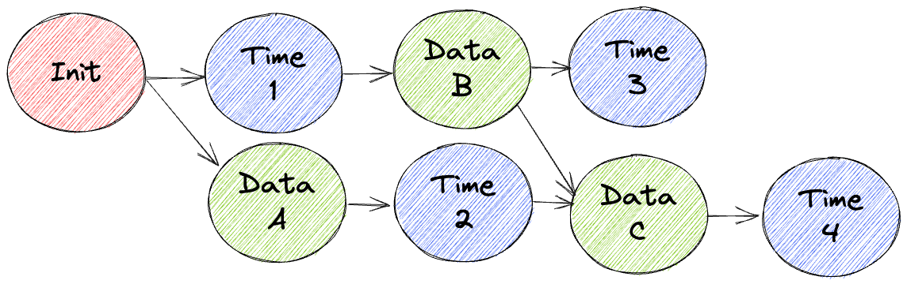

## Simple Summary
Adding the ability to merge diverged branches of a Ceramic stream.

## Abstract
This CIP adds the ability to merge diverged branches of a stream. It describes a modification to the `prev` field for a
Ceramic event so that it can be either a single CID or a list of CIDs (hereinafter referred to as **multi-prev**).

For a `prev` that is a list of CIDs, the aggregation layer may treat these CIDs differently depending on the order. How
this order is interpreted is an implementation detail outside the scope of this spec.

## Motivation
A Ceramic stream can fork if two different events both have the same CID in their `prev` field. This can happen for
various legitimate reasons.

For example, two or more Ceramic nodes generate Data Events to the same Ceramic stream before learning of events
generated from the other node(s).

A special case of this is a race between new Data Events being generated to a stream and Time Events corresponding to
older Data Events in the stream. This type of fork in a stream is easily possible and can only be addressed at the
protocol level. Prior to this CIP, Time Events and Data Events were not considered by the branch pruning rules described
below, and would result in pruning of Data Events coinciding with Time Events.

### Definitions
* A Ceramic `synchronization layer` synchronizes all the events for a Ceramic stream.
* A Ceramic `aggregation layer` converts all the events in a Ceramic stream to its corresponding tip state.
* A `fork point` is the last common ancestor of two events `A` and `B`.
* A `merge point` is the first common descendant of two events `A` and `B`.
* `A` is a `covered event` if another event `B` has `A`'s CID in its `prev` field.
* `A` is an `uncovered event` if there is no event with `A`'s CID in its `prev` field.
* A `diverged stream` has more than one uncovered event.
* A `converged stream` has a single uncovered event.
* An `invalid Data Event` is one that has either an invalid signature or an expired CACAO.
* A `valid Data Event` is one that has a valid signature and a valid CACAO (if applicable).

## Specification

Any stream where there are Data Events without a common descendant is in a diverged state. When a stream diverges,
Ceramic uses the rules below to determine which of the uncovered events will serve as the tip of the stream and which
branches are pruned. Since pruning branches that contain Data Events would result in the pruning of valid data, we allow
a Data Event to contain multiple ancestor events in its `prev` field so that a new merge point Data Event can cover
multiple events.

1. If a stream is in a diverged state (see events `A` and `B` in fig. 5), we only consider branches that contain valid,
   uncovered Data Events.
2. For branches that contain valid, uncovered Data Events, we only consider the first Data Event on a branch after the
   fork.
3. The Data Event that is covered by the earliest Time Event wins (see event `A` in fig. 5). 
4. If two uncovered Data Events are covered by Time Events at the same block height, the Data Event with the lower CID
   wins.

Using multi-prev Data Events allows us to reduce the number of uncovered events and converge the stream so that there is
only a single uncovered event, without any data abandoned on pruned branches. The stream's converged/diverged state can
be determined by looking at the `prev` fields of all the Data Events for that stream.

Events that have invalid signatures cannot be tips, even if uncovered. This has important implications for Data Events
with expired CACAOs. In figures 5 and 6, if we assume event `A` has an expired CACAO, the aggregation layer can choose
to repair the stream by creating a new Data Event `C` with `{ "prev": [CID_Data_B, CID_Time_2] }`. This effectively
prunes the branch with Time Event `2` and merges Data Event `B` into the new event `C`. How this merge is implemented is
at the discretion of the aggregation layer.

### Example
> 
> 
> Fig. 1: A lattice where `1`, `2`, `3` are canonical Data Events (with corresponding Time Events) and `A`, `B` are
> events on a pruned branch. `2` and `A` both have `prev: 1's CID` thereby creating a fork. `3` has a multi-prev
> `prev: [2's CID, B's CID]`, thereby converging the pruned branch back into the stream.

---

> 
>
> Fig. 2: An Init Event is created. The tip of this stream is `Init`, and the stream is anchored at Null.

---

> 
>
> Fig. 3: The Init Event gets anchored and a Time Event is created. The tip of this stream is `Init`, and the stream is
> anchored at Init.

---

>
>
> Fig. 4: Data Event `A` branches off of `Init` not Time Event `1` but there are no Data Events following `1`, so `A` is
> the tip, and the stream is anchored at `A`.

This CIP changes the interpretation of this scenario. Prior to the CIP, the stream would have been anchored at `Init`
but will now be anchored at `A`.

---

> 
>
> Fig. 5: Continuing from fig. 4, Data Event `B` branches off of Time Event `1` and is anchored at Time `3`. `B` happens
> later than Data Event `A`, so the tip is still `A`. We are now in a diverged state as `B` is on a pruned branch.

This CIP changes the interpretation of this scenario. Prior to the CIP, the stream would have been anchored at `B` but
will now be anchored at `A`.

---

> 
>
> Fig. 6: The controller fixes the diverged state by creating a new merge point Data Event `C`, which has a multi-prev
> covering both Time Event `2` and Data Event `B`. `C` is now the tip, and the stream is anchored at `C`.

---

## Backwards Compatibility
Nodes that do not implement this CIP will not understand events with `prev` fields containing multiple CIDs but all
existing streams and events with single `prev` CIDs remain valid.

The branch pruning rules specified in this document supersede the existing Ceramic
[stream consensus rules](https://github.com/ceramicnetwork/docs/blob/main/docs/protocol/streams/consensus.md) given
below, even for streams with single `prev` CIDs.

The main change in this CIP is that we only consider valid Data Events to be candidates for stream tips. This CIP also
drops rule 4 below for considering the length of the stream log after the last Time Event. This eliminates fluctuation
between diverged branches following the addition of new Data Events. This, in turn, prevents the stream from alternating
which branch was pruned.

> A tip and canonical log for a stream are selected by the following pseudo algorithm and rules:
>
> 1. Given a set of tips, traverse each tree path from tip till a commonly shared Time Event or the Init Event.
> 2. From the shared event, traverse each path in the opposite direction (towards tip) until a Time Event is found (or
>    the end of the log is reached). This set of events are considered conflicting events.
> 3. Given each Time Event, determine the blockheight for the transaction included in the timestamp proof. Select the
>    path with lowest blockheight. If a single path is selected, exit with path and tip selected, otherwise continue.
>    Most cases will terminate here, it will be rare to have the same blockheight.
> 4. If multiple tips have the same blockheight, select the path with the greatest number of events from the last
>    timestamp proof till tip. If single path selected, exit with path and tip selected, otherwise continue.
> 5. If number of events is equal, chooses the event and path which has the smallest CID in binary format (an arbitrary
>    but deterministic choice).

## Implementation

legacy `prev`
```json
{ "prev": "CID1"}
```

multi-prev `prev`
```json
{ "prev": ["CID1", "CID2", "CID3"] }
```

Each string in a multi-prev list MUST be a CID. `["CID1"]` or `"CID1"` are treated exactly the same.

## Security Considerations
This CIP improves the robustness of the Ceramic protocol by reconciling data that could otherwise have been abandoned
due to the previous stream consensus rules.

## Copyright
Copyright and related rights waived via [CC0](https://creativecommons.org/publicdomain/zero/1.0/).
