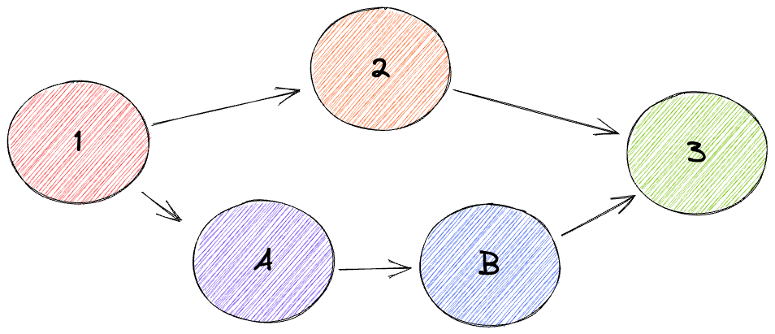

<!--PROPOSE A NEW CIP-->

<!--NOTE: 
You can leave these HTML comments in your CIP and delete the visible text guides, they will not appear and may be helpful to refer to if you edit your CIP again.-->

<!-- STEPS TO SUBMIT A CIP:
1. Complete the header above.
2. Fill in as much content as is appropriate for the status of your CIP.-->

<!--ADDITIONAL INSTRUCTIONS FOR HEADER SECTION ABOVE-->

<!--[title]: Give your issue a concise, descriptive title prefixed by either its *type* for standards CIPs or its category for other CIPs. (i.e. Core: Protocol Upgrade, Meta: Define CIP Process, etc.).-->

<!--[category]: Here is a description of category terms.
- `Core`: an CIP that affects the core protocol.
- `Networking`: an CIP thst affects the networking layer (i.e. libp2p or syncing).
- `Interface`: an CIP that affects the Ceramic API or provider interface.
- `RFC`: an CIP that proposes an implementation standard (i.e. doctypes, document configurations, or document schemas).
- `Meta`: an CIP that affects the governance process for CIPs.-->

<!--[requires]: A list of CIP(s) that this CIP depends on. *Optional.-->

<!--[replaces]: A list of CIP(s) that this CIP replaces. *Optional.-->

## Simple Summary
<!--Provide a simplified and layman-accessible explanation of the CIP.-->
Multi-prev allows the `priv` field in a ceramic event header to be a list of string rather then a string. This is an ordered list and the abrogator may treat the same set of priv CIDs differently depending on the order.


## Abstract
<!--A short (~200 word) description of the technical issue being addressed.-->
Abstract goes here.


## Motivation
<!--Motivation is critical for CIPs that want to change the Ceramic protocol. It should clearly explain why the existing protocol specification is inadequate to address the problem that the CIP solves. CIP submissions without sufficient motivation may be rejected outright.-->
A Ceramic stream can fork if two different event both have the same CID in their `priv` field. 


Fig. 1: A lattice where 1, 2, 3 are events that got anchored and A, B are events on a pruned branch. 2 and A both have `prev: 1's CID` creating a branch. 3 has a multi-prev `priv: [2's CID, B's CID]` joining the pruned branch back into the stream. 

When a stream forks Ceramic uses a set of rules to determine witch of the multiple uncovered nodes will serve as the tip of the stream. The other uncovered events are on dead branches. If a pruned branch contains only time events and no data events it can be safely ignored. If a branch pruned branch contains data events then that data would be lost. In order to fix this we enable a event to specify multiple previous event so that a single event can cover more then one event.

With a multiple previous event we can reduce the number of uncovered events and call any stream where there is only a single uncovered converged state. Any stream where there are data events without a common descendent are in a diverged state. The streams converged/diverged state can be determined just by looking at the `prev` field of the event headers of the events for that stream.

* A join `A ⋁ B` find the common ancestor of the events `A` and `B`
* A meet `A ⋀ B` find the common descendent of the events `A` and `B`

## Specification
<!--The technical specification should describe the syntax and semantics of any new feature.-->
Specification goes here.


## Rationale
<!--The rationale fleshes out the specification by describing what motivated the design and why particular design decisions were made. It should describe alternate designs that were considered and related work, e.g. how the feature is supported in other languages. The rationale may also provide evidence of consensus within the community, and should discuss important objections or concerns raised during discussion.-->
Rationale goes here.


## Backwards Compatibility
<!--All CIPs that introduce backwards incompatibilities must include a section describing these incompatibilities and their severity. The CIP must explain how the author proposes to deal with these incompatibilities. CIP submissions without a sufficient backwards compatibility section may be rejected outright.-->
All events that have a string in `prev` instead of a list will work with this CIP.
Nodes that don't have this CIP will not understand what new events with a `prev` list means.


## Implementation
<!--The implementations must be completed before any CIP is given status "Final", but it need not be completed before the CIP is accepted.-->
Implementation goes here.

legacy `priv`
```json
{ "prev" = [CID, CID, CID]}
```

multi-priv `priv`
```json
{ "prev" = [CID, CID, CID]}
```


## Security Considerations
<!--All CIPs must contain a section that discusses the security implications/considerations relevant to the proposed change. Include information that might be important for security discussions, surfaces risks and can be used throughout the life cycle of the proposal. E.g. include security-relevant design decisions, concerns, important discussions, implementation-specific guidance and pitfalls, an outline of threats and risks and how they are being addressed. CIP submissions missing the "Security Considerations" section will be rejected. An CIP cannot proceed to status "Final" without a Security Considerations discussion deemed sufficient by the reviewers.-->
Security considerations go here.


## Copyright
Copyright and related rights waived via [CC0](https://creativecommons.org/publicdomain/zero/1.0/).
