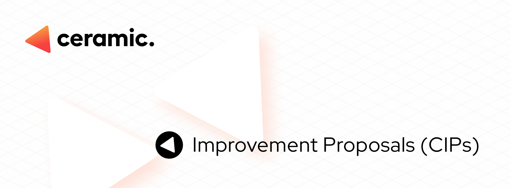

# Ceramic Improvement Proposals (CIPs)

The goal of the Ceramic Improvement Proposals (CIPs) is to create standards and document improvements to Ceramic. This includes  standards for the Ceramic platform, such as core protocol specifications, Ceramic APIs, and usage conventions such as streamtypes, and DID methods.

# CIP Status Page
On the [status page](https://cips.ceramic.network) an up to date list of CIPs and their statuses.

# Contributing
Before contributing consider discussing and validating your idea on the [Ceramic forum](https://forum.ceramic.network/) before creating a CIP.

To create a new CIP simply follow these steps:

1. Review [CIP-1](https://cips.ceramic.network/CIPs/cip-1).
2. Fork the repository.
3. Add your CIP to your fork of the repository. There is a [template CIP here](https://github.com/ceramicnetwork/CIPs/blob/main/cip-template.md).
4. Submit a Pull Request.

# Editors
- Aaron Goldman ([@AaronGoldman](https://github.com/AaronGoldman))
- Michael Sena ([@michaelsena](http://github.com/michaelsena))
- Joel Thorstensson ([@oed](http://github.com/oed))
- Spencer T Brody ([@stbrody](http://github.com/stbrody))

